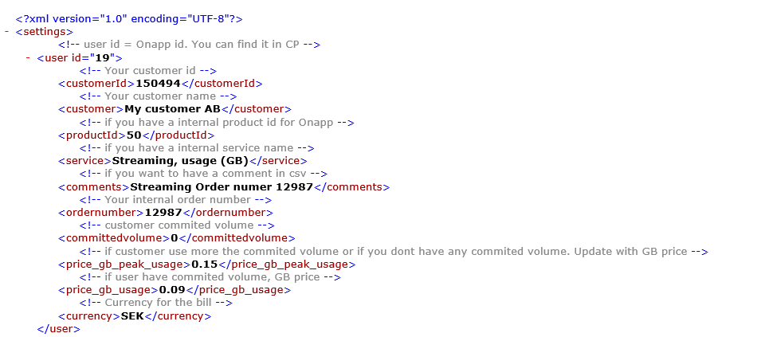
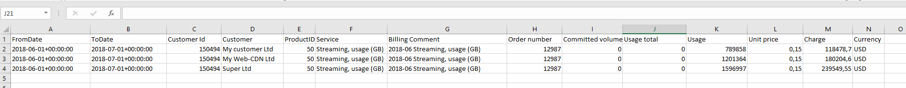
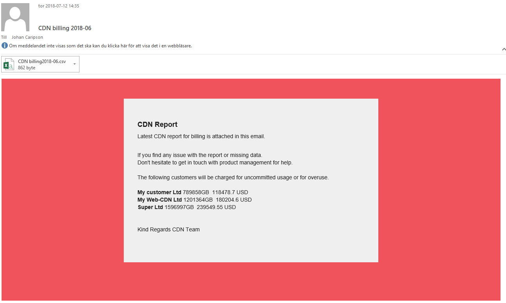

# Onapp CDN billing tool
Get CDN statistics from Onapp API, create a csv file and mail it to billing admin . Accounts deatils in billingSettings.xml

## Setup

1. Install git
```
sudo apt-get -y install git

```
Make tmp directory and clone
```
cd /
sudo mkdir /tmp
cd /tmp
git clone https://github.com/Caripson/Onapp_CDN_billing_tool.git

```

2. Install php

```
sudo apt-get install php7.2
sudo apt-get install php7.2-xml

```

3. Update settings.php with credentials, adress to CP, gmail settings and csv output

```
vi /tmp/Onapp_CDN_billing_tool/settings.php

$my_email = "your@email.com";
$my_apiKey = "API_KEY_FROM_ONAPP_CP";
$my_onappURL = "https://YOUR.URL.TO.ONAPP.CP";

$GMAILusername = "billingScript@company.com";
$GMAILpassword = "PASSW0RD";
$GMAILfrom ="billingScript@company.com";
$billingMAIL = "billing@company.com";
$csvURL='/tmp/Onapp_CDN_billing_tool/' .  getDateYear(). '-'. fixdate(getDateMonth()-1) . '_ouput.csv';

$MAILrecipient=array("team@home.com","staff@home.com","accounts@home.com");
$MailaddCC=array("noc@home.se");
$MailaddBCC=array("max@home.com");


```


3. Update billingSettings.xml with customer info

```
vi /tmp/Onapp_CDN_billing_tool/billingSettings.xml
```



You are now done, run the script

```
php /tmp/Onapp_CDN_billing_tool/runme.php > /tmp/Onapp_CDN_billing_tool/ouput.csv

```

if you want latest update. <b>Make sure to backup your settings before running the command. </b>

```
/tmp/Onapp_CDN_billing_tool# git pull origin master
```

Setup crontab, Running the cronjob every first Monday of a Month.

```
crontab -e

0 9 1 * * /usr/bin/php /tmp/Onapp_CDN_billing_tool/runme.php
```

CSV Screenshot


Mail Screenshot


# License

Unless stated otherwise all works are licensed under MIT License.
PHPMailer is licensed under GNU Lesser General Public License v2.1

# Contributors
Become a contributor to this project!

# Sponsors
No sponsors yet! Will you be the first?<br>
Become a contributor to this project!<br><br>
[](https://www.paypal.com/cgi-bin/webscr?cmd=_donations&business=johan%2ecaripson%40gmail%2ecom&lc=SE&currency_code=SEK&bn=PP%2dDonationsBF%3abtn_donateCC_LG%2egif%3aNonHosted)

## Support on Beerpay
Hey dude! Help me out for a couple of :beers:!

[](https://beerpay.io/Caripson/Onapp_CDN_billing_tool)  [](https://beerpay.io/Caripson/Onapp_CDN_billing_tool?focus=wish)